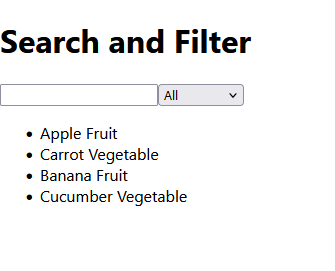

# React Search and Filter App

A simple React application demonstrating how to implement search and filter features for a dataset.

## Features
- **Search**: Filter items by typing a search query.
- **Category Filter**: Filter items based on a selected category (e.g., "Fruit", "Vegetable").
- **Real-Time Updates**: Filtered results update as you type or change the category.

## Demo


## Technologies Used
- React (useState for state management)
- JavaScript (Array filtering)
- HTML/CSS for basic styling

## Getting Started

### Prerequisites
- Node.js installed on your computer
- Basic understanding of React and JavaScript

### Installation

1. Clone the repository:
   ```bash
   git clone https://github.com/your-username/react-search-filter-app.git
   cd react-search-filter-app
npm install
npm start

### Project Structure
.
├── src
│   ├── App.js         # Main application file
│   ├── index.js       # Entry point for React
│   └── index.css      # Styling for the app
├── package.json       # Project dependencies and scripts
└── README.md          # Project documentation


